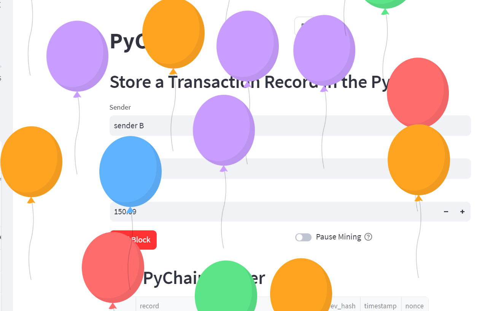
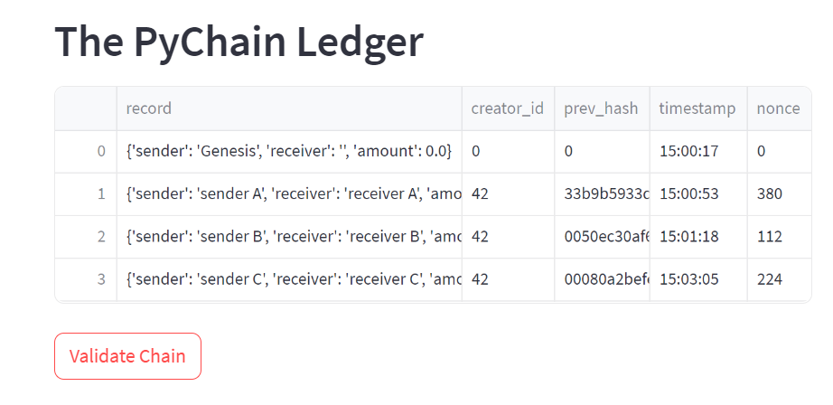
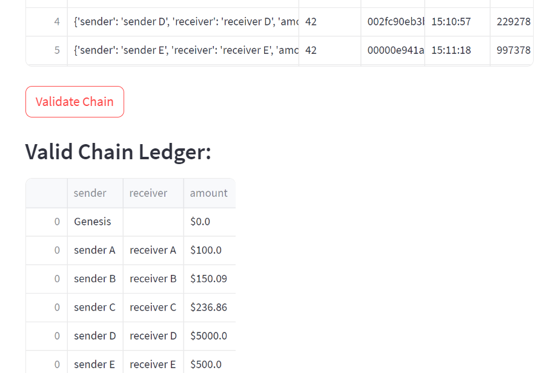
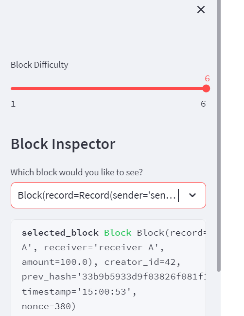
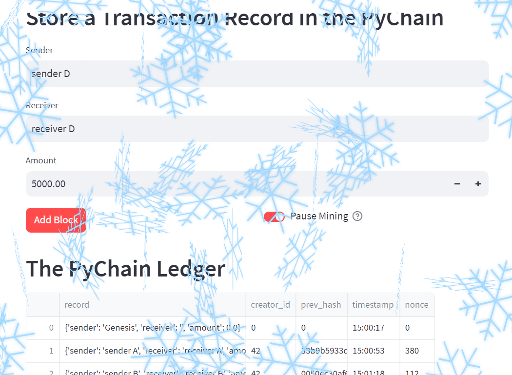
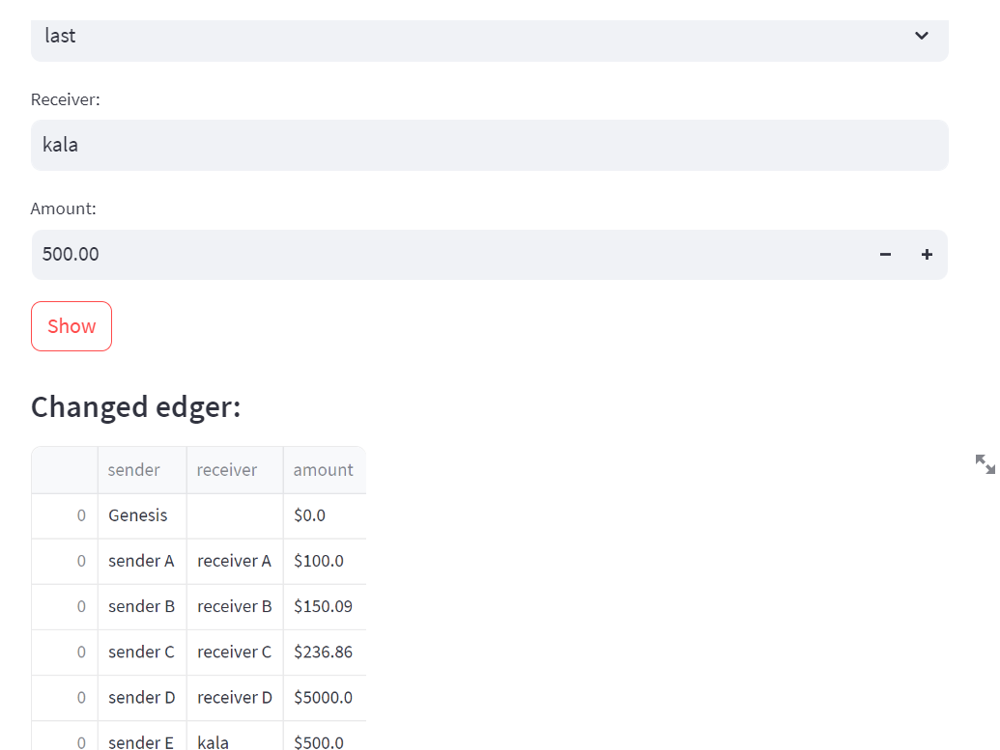
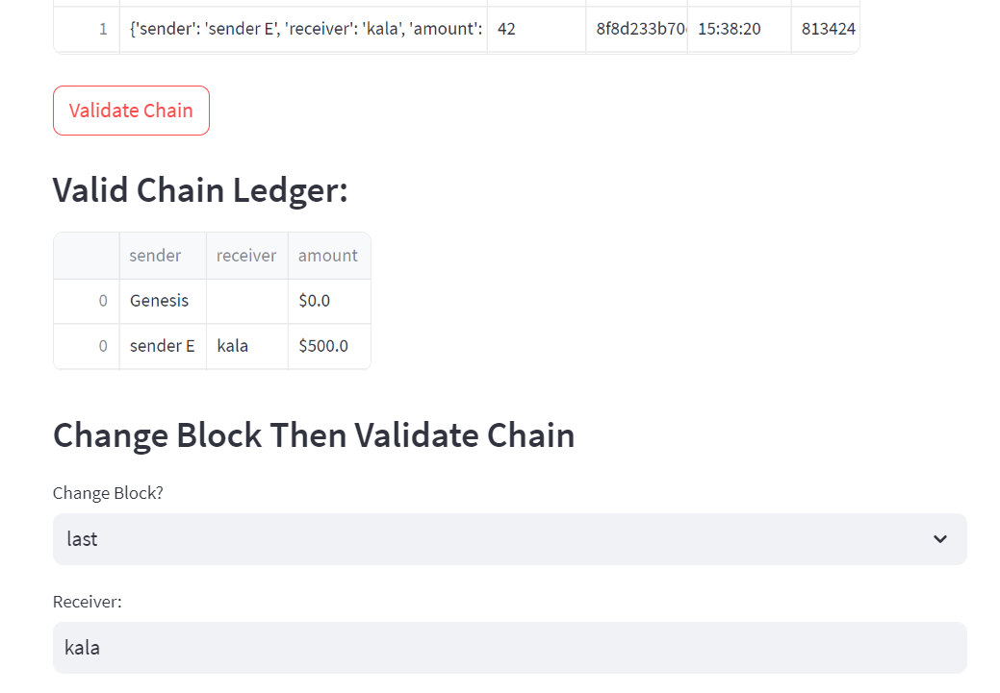
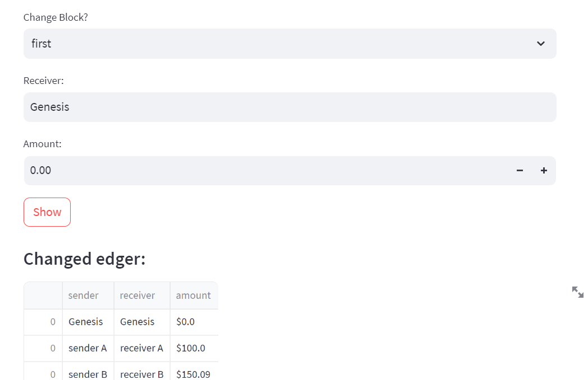
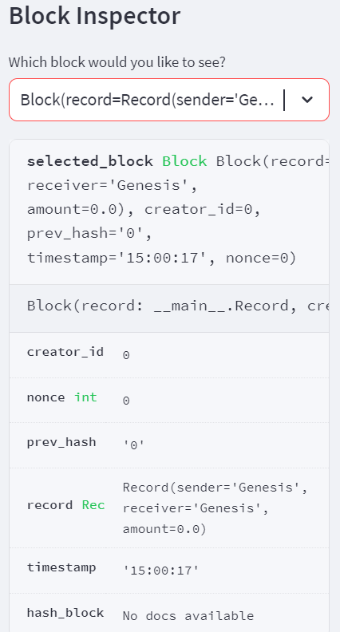

# homework-blockchain

This is a homework exploring basic blockchain components and features, using Python, Pandas and Streamlit.

## The Chain

The chain of blocks records a ledger of history consisted with 3 information:
* Sender Name
* Receiver Name
* Amount

As a basic block chain, each block of the ledger history also includes features:
* Creator ID
* Previous Hash
* Nonce
* Timestamp

We use SHA256 to calculate the hash of all information. 

## The Tests

As one of the aspects to explore, levaraging streamlit, the targeting hash is alllowed to have leading zeros from 1 to 6, according to which the Nonce is mined, called "proof of work".

Only with the proper nonce meeting the target leading zero, a new block can be added to the chain.

When the difficulty of mining the nonce is high, we can pause the mining instead of running and waiting forever.

One other test is to check if the chain is a valid one, i.e., each block having its previous hash stored authenticated. If any block in the chain is changed, this validation will fail.

We also provide a function to try and change some information then validate the chain. Interestingly, we found that the last block can be changed without issue, but previous blocks cannot.

## Demo

### Build the chain

From a preset "genesis" block, we can input the information to build a new block, then add it to the chain.

### See the chain

Whenever a new block is added, the "chain view" extends to show it.

### Validate chain

Click the Validate Chain button, if the chain is validated, the ledger is displayed for easy read.

### Pause during long-run mining

High difficulty

Toggle to pause mining

### Valid change

We can change the last block

It's valid!

### Invalid change

Change the first block (it does not have ledger info!)

It's invalid!

### Inspect the block

Although the change makes the chain invalid, we still can inspect the block.

### Last but not least

* If we change back the info, the chain becomes valid again.
* We have a Rerun button which if you click the chain starts from afresh